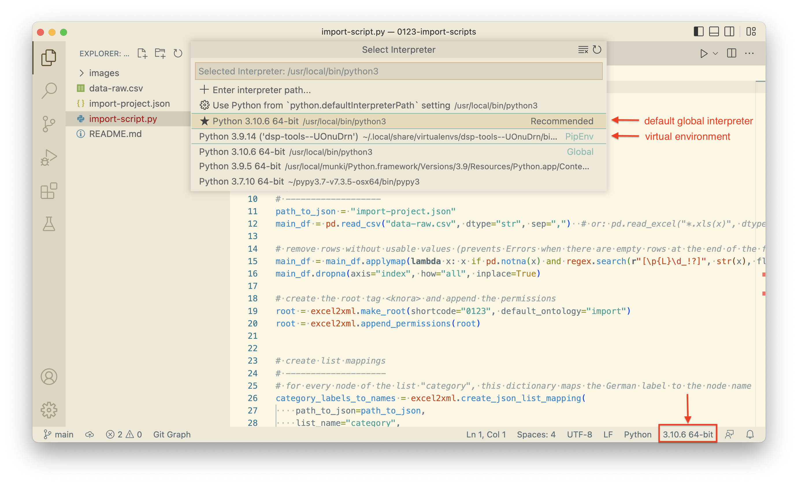
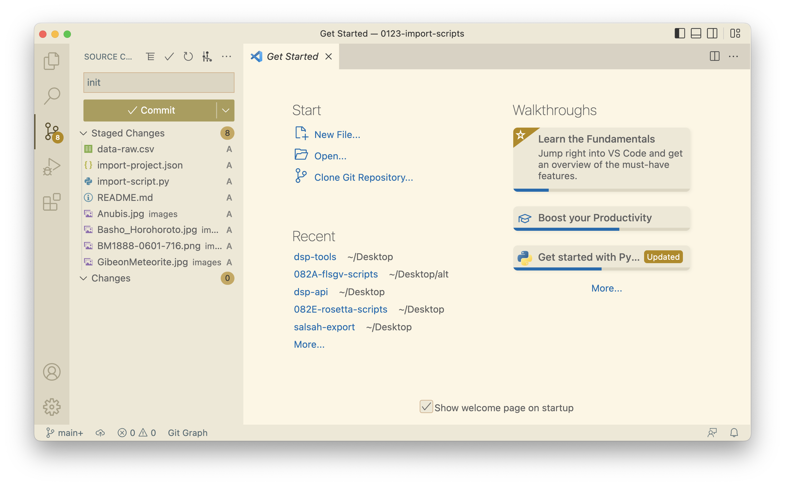

# Welcome to 00A1-import-scripts

This is a template repository 
that can be used for the archiving process of a big dataset 
at the end of a research project's lifetime. 
For this purpose, 
the [`excel2xml` module](https://docs.dasch.swiss/latest/DSP-TOOLS/excel2xml-module) 
of DSP-TOOLS was developed. 

This README guides you through the steps to set up a repository. 
After that, you can learn how to use `excel2xml` in a Python script
in the documentation of the [`excel2xml` module](https://docs.dasch.swiss/latest/DSP-TOOLS/excel2xml-module).

## Table of Contents

- [Open this repository in Visual Studio Code](#open-this-repository-in-visual-studio-code)
    - [Create a data model with `excel2json`](#create-a-data-model-with-excel2json)
    - [Import script](#import-script)
- [The benefits of the Debugging Mode](#the-benefits-of-the-debugging-mode)
- [The benefits of Version Control with Git](#the-benefits-of-version-control)
    - [Make a commit](#make-a-commit)
    - [Publish your repo on dasch-swiss](#publish-your-repo-on-dasch-swiss)
- [Some extras](#some-extras)
    - [Data cleaning with OpenRefine](#data-cleaning-with-openrefine)
    - [Git GUIs](#git-guis)
    - [Learn, build and test RegEx](#learn-build-and-test-regex)


## Open this repository in Visual Studio Code

From within [GitHub Desktop](https://desktop.github.com/), clone this repository, and open it in [Visual Studio 
Code](https://code.visualstudio.com/download). You will be prompted to install some extensions that are recommended for 
importing data in DaSCH. After installing them, navigate to `README.md` and press ⌘⇧V (Ctrl+Shift+V on Windows) to get a 
preview.  


### Create a data model with `excel2json`

Before importing data into DSP, you need a data model. We have created a very easy one for you to get started: 
`import_project.json`. In order not to type everything by hand in JSON, you can create your data model in Excel, and 
then use the command [`dsp-tools excel2json`](https://docs.dasch.swiss/latest/DSP-TOOLS/cli-commands/#excel2json)
to convert it to JSON. The folder `data_model_files` contains the Excel files necessary to create `import_project.json`.


### Import script

Open `import_script.py`. You can now choose a Python interpreter by clicking on the Version number on the bottom right.
You can either work with the global (system-wide) Python, or you can create a 
[virtual environment](https://python.land/virtual-environments) for your project.  
DaSCH employees who have installed Python via Homebrew can choose that one. 
To find it, type`brew --prefix` in a Terminal. 
Probably you already have a symlink (`/usr/local/bin/python3` or `/usr/bin/python3`) 
that redirects to the Homebrew-installed Python.  
The only thing that you shouldn't do is selecting a virtual environment of another project.




## The benefits of the debugging mode

To start the debugging process, switch to the "Run and Debug" tab.

1. set a break point
2. click "Run and Debug"
3. choose "Debug the currently active Python file"
4. The control bar appears, and debugging starts.


Code execution will interrupt at your break point, that means, before the line of the break point is executed. Use 
this opportunity to inspect what has been done until now in the "Variables" area on the left, where the current state of
the program is shown.  

If one of the dependencies is not installed, code execution will not reach your break point, but stop at the missing
dependency. In this case, install the missing dependency with `pip install package` in the Terminal of Visual Studio 
Code.


If you want to experiment with different scenarios how to proceed, go to the "Debug Console" where you can execute 
code. For example, let's inspect the Pandas Dataframe by typing `main_df.info`.  
You see that there are some empty rows at the end which don't contain useful data. The next two lines of code will 
eliminate them. Click on "Step Over" two times, or set a new break point two lines further down and click on "Continue".
Now, type again `main_df.info` in the Debug Console. You will see that the empty rows are gone.  


You see that the debugging mode is a useful tool to understand code and to inspect it for correctness. 

| **Tip**                                                                                                   |
|-----------------------------------------------------------------------------------------------------------|
| **Make regular use of the debugging mode to check if your code really does what you think it should do!** | 


## The benefits of version control

One of the big benefits of version control is the diff viewer. Visual Studio Code highlights the changes you have 
introduced since your last commit. 

- Deletions are shown as red triangle.
- Additions are shown as green bars.
- Changed lines are shown as striped bars.

Click on these visual elements to see a small popup that shows you the difference. In the popup, you can stage the 
change, revert it, or jump to the next/previous change.


### Make a commit

Once you have a bunch of code changes that can be meaningfully grouped together, you should make a commit. 
If you click on "Commit", all staged changes will be committed:



| **Tips**                                                                |
|-------------------------------------------------------------------------|
| **Test your code (e.g. with the debugging mode) before committing it.** | 
| **Make small commits that contain only one new feature.**               | 


### Publish your repo on dasch-swiss

If you work on a big project where you spend weeks/months on, you might want to have a backup, or to invite colleagues for 
collaboration or a code review. For this purpose, follow these steps:

- create an own repository on [https://github.com/dasch-swiss/](https://github.com/dasch-swiss/)
- name it according to the scheme `[project_shortcode]-[project_shortname]-scripts`
- in the "Source Control" tab of VS Code, click on the three dots, and choose Remote > Add Remote..., and set the upstream to `https://github.com/dasch-swiss/shortcode-shortname-scripts`
- push your local repo to your new GitHub repo

| **WARNING**                                                                                                            |
|------------------------------------------------------------------------------------------------------------------------|
| **Do NOT push to <https://github.com/dasch-swiss/00A1-import-scripts> ! This is a template and should remain as it is!** | 


## Some extras

### Data cleaning with OpenRefine

[**OpenRefine**](https://openrefine.org/) is a tool for working with messy data. Once downloaded and installed, it runs 
as a local server, accessed by your browser. So, all data remains on your own machine. If you work on a Mac and have 
Homebrew installed, you can simply type: 

```bash
brew install openrefine
```

The potentials for the everyday work of the Research Data Unit at DaSCH are twofold:

1. Data cleaning (recommended): For this purpose, you can think of OpenRefine as a much better version of Excel. You 
   can perform operations which would be very tiresome in Excel.
2. Conversion to our DSP-specific XML format for bulk upload (not recommended)


### Git GUIs

Git can be complicated, so you will appreciate to work with one of these GUIs:

- [**GitHub Desktop**](https://desktop.github.com/)
- [**SourceTree**](https://www.sourcetreeapp.com/)


### Learn, build and test RegEx

[https://regexr.com](https://regexr.com)
